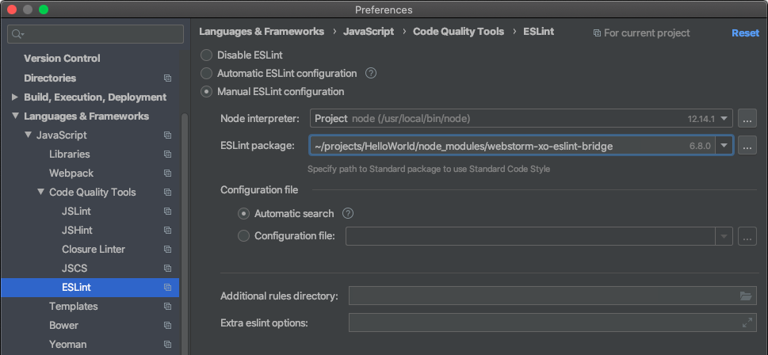

# `eslint` bridge for `xo` for Webstorm

Webstorm provides real time highlighting of errors for `eslint`, but not `xo`.

This project aims to trick Webstorm into calling `xo` instead of `eslint` by mimicking a tiny portion of the `eslint` api.

## Caveats

Tested on `2020-03-11T04:23:11.198Z` with and only with
* [Webstorm](https://www.jetbrains.com/webstorm/) 2019.3.3
* [xo](https://github.com/xojs/xo) 0.27.3
* [eslint](https://eslint.org/) 6.8.0
* node 12.14.1
* macOS 10.15.3

I didn't expect this tool to be so simple to hack together.
If it ends up needing to be more complicated because of future changes to xo, eslint or Webstorm, I offer no guarantees of future support.
PRs for additional features or support are welcome.

## Setup

1. `npm install -D webstorm-xo-eslint-bridge`
2. In Webstorm, open the preferences
    1. Go to `Languages & Frameworks > JavaScript > Code Quality Tools > ESLint`
    2. Choose `Manual ESLint configuration`
    3. Choose this package as the `ESLint package`
    4. Click Apply

## Development Notes

If something breaks, you'll want to dig into the Webstorm eslint plugin integration layer.
On my machine, I found it here: `/Applications/WebStorm.app/Contents/plugins/JavaScriptLanguage/languageService/eslint/bin/eslint-plugin.js`

Webstorm appears to perform some verification of the package version, so the version number of this package is closely aligned with the eslint version.

My own usage of this bridge found a memory leak somewhere. As a work around for this leak, xo is run in a subprocess.

During development, you will need to issue `pkill -f debug-name=eslint` to have webstorm restart the plugin (and reload the bridge).
Even still, webstorm has some timers and caches around running the linter.
I found it helpful to cycle between 5 different files.
